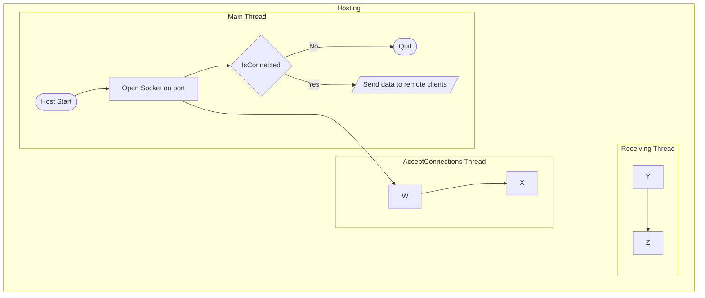

```mermaid
flowchart LR
    subgraph Hosting
        direction LR
        mt ~~~~~ act ~~~~~ rt
        subgraph mt [Main Thread]
            direction TB
            A([Host Start])-->B[Open Socket on port]
            B-->D{IsConnected}
            D-- No -->E([Quit])
            D-- Yes -->F[/Send data to remote clients/]
        end
        subgraph act [AcceptConnections Thread]
            direction TB
            B-->W
            W-->X
        end
        subgraph rt [Receiving Thread]
            direction TB
            Y-->Z
        end
    end
```
