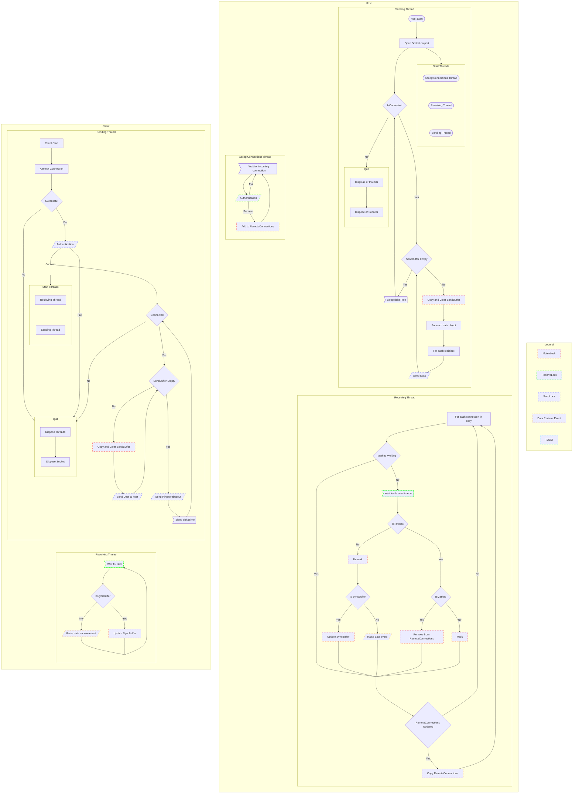
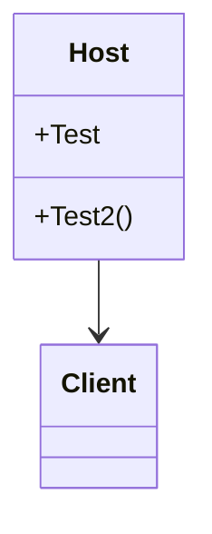

```mermaid
flowchart
    classDef hidden display: none;
    classDef MutexLock stroke:#ff0000, stroke-dasharray: 5 5;
    classDef RecieveLock stroke:#00ff00, stroke-dasharray: 5 5;
    classDef SendLock stroke:#0000ff, stroke-dasharray: 5 5;
    classDef DRE stroke:#ff9d00, stroke-dasharray: 5 5;
    classDef TODO stroke:#6bf0ff, stroke-dasharray: 5 5;
    %% unused #d4ff00
    subgraph Legend
        direction TB
        ml[MutexLock]:::MutexLock ~~~ rl[RecieveLock]:::RecieveLock ~~~ sl[SendLock]:::SendLock ~~~ dre[Data Recieve Event]:::DRE ~~~ todo[TODO]:::TODO
    end
    subgraph Host
        direction LR
        HostingAcceptConnectionsThread ~~~ HostingSendingThread
        HostingReceivingThread
        subgraph HostingSendingThread [Sending Thread]
            direction TB
            HostStart([Host Start]) --> OpenSocket[Open Socket on port] --> IsConnected & HostStartThreads
            IsConnected{IsConnected} -- Yes ---> SendBufferEmpty{SendBuffer Empty} -- Yes --> HostSendSleep>Sleep deltaTime] --> IsConnected
            SendBufferEmpty -- No --> CopyBuffer[Copy and Clear SendBuffer]:::MutexLock --> DataObjLoop[For each data object] --> RecipientLoop[For each recipient]
            RecipientLoop --> SendData[/Send Data/]:::SendLock --> SendBufferEmpty
            IsConnected -- No --> HostQuit
            subgraph HostStartThreads [Start Threads]
                direction TB
                act([AcceptConnections Thread]) ~~~ rt([Receiving Thread]) ~~~ st([Sending Thread])
            end
            subgraph HostQuit [Quit]
                direction TB
                HostDisposeThreads[Displose of threads] --> HostDisposeSockets[Dispose of Sockets]
            end
        end
        subgraph HostingAcceptConnectionsThread [AcceptConnections Thread]
            direction TB
            WaitConnection>Wait for incoming connection] --> HostAuthenticate[/Authentication/]:::RecieveLock -- Success --> AddConnection[Add to RemoteConnections]:::MutexLock --> WaitConnection
            HostAuthenticate -- Fail --> WaitConnection
        end
        subgraph HostingReceivingThread [Receiving Thread]
            direction TB
            CheckConnectionsUpdate{RemoteConnections Updated}
            CheckConnectionsUpdate -- Yes --> CopyConnections[Copy RemoteConnections]:::MutexLock --> ConnectionLoop
            CheckConnectionsUpdate -- No --> ConnectionLoop
            h1:::hidden
            subgraph h1
                ConnectionLoop[For each connection in copy] --> IsWaiting{Marked Waiting} -- No --> DataWait>Wait for data or timeout]:::RecieveLock --> IsTimeout{IsTimeout} -- No --> HostUnmark[Unmark]:::MutexLock --> HostIsSyncBuffer{Is SyncBuffer} -- No --> PassData[/Raise data event/]:::DRE
                HostIsSyncBuffer -- Yes --> HostUpdateSyncBuffer[Update SyncBuffer]:::MutexLock
                IsWaiting -- Yes --- h2
                IsTimeout -- Yes --> IsMarked{IsMarked} -- Yes --> RemoveConnection[Remove from RemoteConnections]:::MutexLock
                IsMarked -- No --> Mark[Mark]:::MutexLock
            end
            HostUpdateSyncBuffer & PassData & RemoveConnection & Mark ---- h2:::hidden --> CheckConnectionsUpdate
        end
    end
    subgraph Client
        direction TB
        ClientSendingThread ~~~ ClientReceivingThread
        subgraph ClientSendingThread [Sending Thread]
            direction TB
            ClientStart[Client Start] --> AttemptConnection[Attempt Connection] --> ConnectionSuccess{Successful} -- No --> ClientQuit([Quit])
            ConnectionSuccess -- Yes --> ClientAuthenticate[/Authentication/]:::SendLock
            ClientSort:::hidden
            subgraph ClientSort
                ClientAuthenticate[/Authentication/]:::SendLock -- Fail --> ClientQuit
                ClientAuthenticate --- ClientAuthSuccess[Success] --> ClientStartThreads
                ClientAuthSuccess --> ClientConnected{Connected} -- No ---> ClientQuit
                ClientConnected -- Yes --> ClientSendBufferEmpty{SendBuffer Empty} -- No --> ClientCopyBuffer[Copy and Clear SendBuffer]:::MutexLock --> ClientSendData[/Send Data to host/]:::SendLock  --> ClientSendBufferEmpty
                ClientSendBufferEmpty -- Yes ---> ClientPing[/Send Ping for timeout/]:::SendLock --> ClientSendSleep>Sleep deltaTime] --> ClientConnected
            end
            subgraph ClientStartThreads [Start Threads]
                direction TB
                crt[Recieving Thread] ~~~ cst[Sending Thread]
            end
            subgraph ClientQuit [Quit]
                direction TB
                ClientDisposeThreads[Dispose Threads] --> ClientDisposeSocket[Dispose Socket]
            end
            style ClientAuthSuccess display:none;
        end
        subgraph ClientReceivingThread [Receiving Thread]
            direction TB
            ClientRecieveWait>Wait for data]:::RecieveLock
            ClientRecieveWait --> ClientIsSync{IsSyncBuffer} -- No --> ClientHandleData[/Raise data recieve event/]:::DRE
            ClientIsSync -- Yes --> ClientUpdateSync[Update SyncBuffer]:::MutexLock
            ClientHandleData & ClientUpdateSync --- h4:::hidden --> ClientRecieveWait
        end
    end
```

```mermaid
classDiagram
    Host --> Client
    class Host{
        +Test
        +Test2()
    }
```
