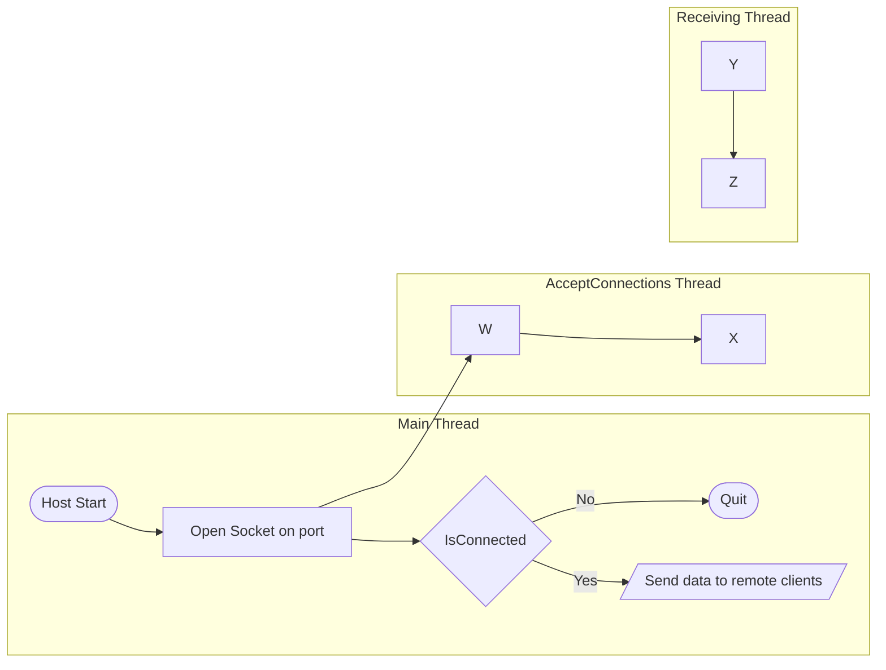

```mermaid
flowchart LR
  mt ~~~ act ~~~ rt
  subgraph mt [Main Thread]
    direction TB
    A([Host Start])-->B[Open Socket on port]
    B-->C{IsConnected}
    C-- No -->D([Quit])
    C-- Yes -->E[/Send data to remote clients/]
  end
  subgraph act [AcceptConnections Thread]
    direction TB
    B-->W
    W-->X
  end
  subgraph rt [Receiving Thread]
    direction TB
    Y-->Z
  end
```