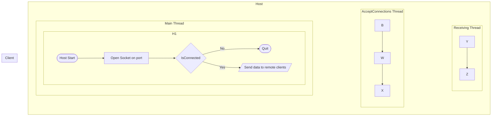

```mermaid
flowchart TB
    subgraph Host
        direction LR
        mt ~~~~~ act ~~~~~ rt
        subgraph mt [Main Thread]
            direction TB
            subgraph hidden1 [H1]
                A1([Host Start])-->B1[Open Socket on port]
                B1-->D1{IsConnected}
                D1-- No -->E1([Quit])
                D1-- Yes -->F1[/Send data to remote clients/]
            end
        end
        subgraph act [AcceptConnections Thread]
            direction TB
            B-->W
            W-->X
        end
        subgraph rt [Receiving Thread]
            direction TB
            Y-->Z
        end
    end
    subgraph Client
        direction TB
        
    end
```
