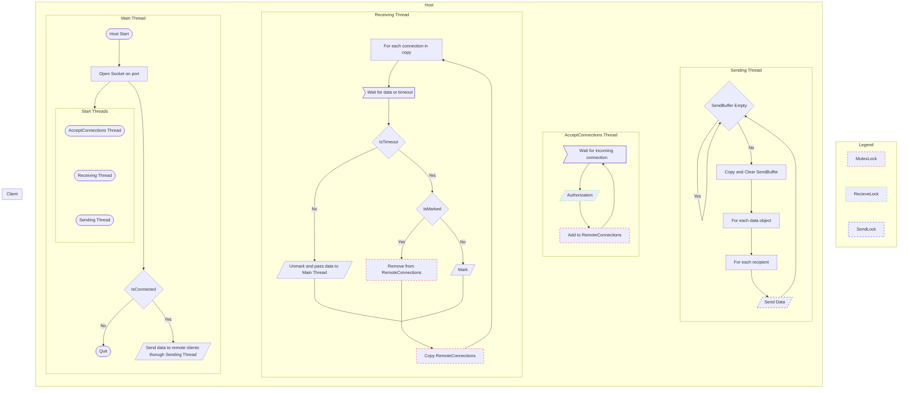

```mermaid
flowchart
    subgraph Legend
        direction TB
        ml[MutexLock]:::MutexLock ~~~ rl[RecieveLock]:::RecieveLock ~~~ sl[SendLock]:::SendLock
    end
    subgraph Host
        direction LR
        mt ~~~~ rt ~~~ act ~~~~ st
        subgraph mt [Main Thread]
            direction TB
            A1([Host Start])-->B1[Open Socket on port]
            B1--->D1{IsConnected}
            D1-- No -->E1([Quit])
            D1-- Yes -->F1[/Send data to remote clients thorugh Sending Thread/]
            B1-->st1
            subgraph st1 [Start Threads]
                direction TB
                G1([AcceptConnections Thread]) ~~~ H1([Receiving Thread]) ~~~ I1([Sending Thread])
            end
        end
        subgraph act [AcceptConnections Thread]
            direction TB
            A2>Wait for incoming connection] --> B2[/Authorization/]:::RecieveLock --> C2[Add to RemoteConnections]:::MutexLock --> A2
        end
        subgraph rt [Receiving Thread]
            direction TB
            A3[Copy RemoteConnections]:::MutexLock --> B3
            h1:::hidden
            subgraph h1[" "]
                B3[For each connection in copy] --> C3>Wait for data or timeout]:::RecievingLock --> D3{IsTimeout} -- No --> E3[/Unmark and pass data to Main Thread/]
                D3 -- Yes --> F3{IsMarked} -- Yes --> G3[Remove from RemoteConnections]:::MutexLock
                F3 -- No --> H3[/Mark/]
            end
            E3 & G3 & H3 --- I3[" "]:::hidden --> A3
        end
        subgraph st [Sending Thread]
            direction TB
            A4{SendBuffer Empty} -- Yes --> A4
            A4 -- No --> B4[Copy and Clear SendBuffer]:::MutexLOck --> C4[For each data object] --> D4[For each recipient]
            D4 --> E4[/Send Data/]:::SendLock --> A4
        end
    end
    subgraph Client
        direction TB
        
    end
    classDef hidden display: none;
    classDef MutexLock stroke:#ff0000, stroke-dasharray: 5 5;
    classDef RecieveLock stroke:#00ff00, stroke-dasharray: 5 5;
    classDef SendLock stroke:#0000ff, stroke-dasharray: 5 5;
```
