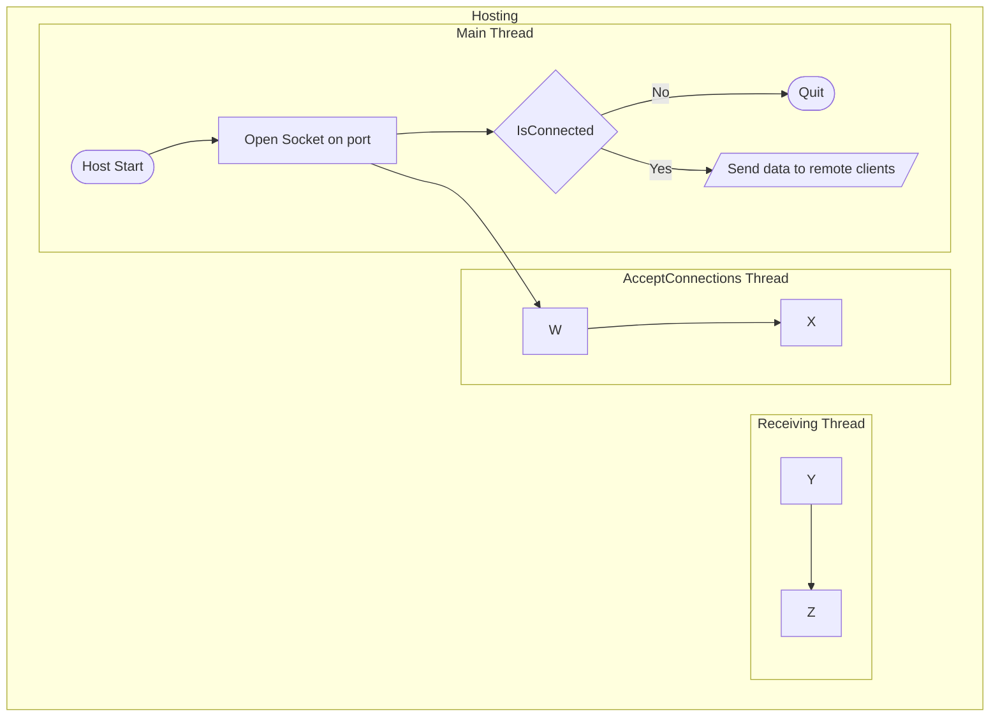

```mermaid
flowchart TB
 subgraph Hosting
  direction LR
  mt ~~~ act ~~~ rt
    subgraph mt [Main Thread]
      A([Host Start])-->B[Open Socket on port]
      B-->D{IsConnected}
      D-- No -->E([Quit])
      D-- Yes -->F[/Send data to remote clients/]
    end
    subgraph act [AcceptConnections Thread]
      B-->W
      W-->X
    end
    subgraph rt [Receiving Thread]
      Y-->Z
    end
 end
```