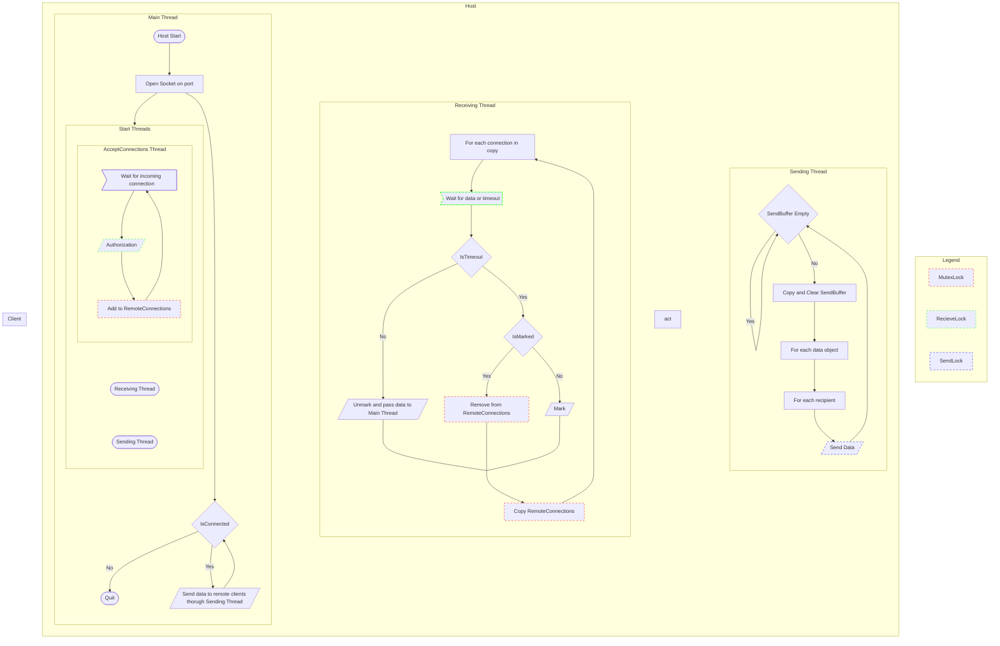

```mermaid
flowchart
    subgraph Legend
        direction TB
        ml[MutexLock]:::MutexLock ~~~ rl[RecieveLock]:::RecieveLock ~~~ sl[SendLock]:::SendLock
    end
    subgraph Host
        direction LR
        mt ~~~~ rt ~~~ act ~~~~ st
        subgraph mt [Main Thread]
            direction TB
            HostStart([Host Start]) --> OpenSocket[Open Socket on port]
            OpenSocket ---> IsConnected{IsConnected}
            IsConnected -- No --> HostQuit([Quit])
            IsConnected -- Yes --> HostSendData[/Send data to remote clients thorugh Sending Thread/] --> IsConnected
            OpenSocket --> HostStartThreads
            subgraph HostStartThreads [Start Threads]
                direction TB
                AcceptConnectionsThread([AcceptConnections Thread]) ~~~ ReceivingThread([Receiving Thread]) ~~~ SendingThread([Sending Thread])
            end
        end
        subgraph AcceptConnectionsThread [AcceptConnections Thread]
            direction TB
            WaitConnection>Wait for incoming connection] --> Authorization[/Authorization/]:::RecieveLock --> AddConnection[Add to RemoteConnections]:::MutexLock --> WaitConnection
        end
        subgraph rt [Receiving Thread]
            direction TB
            CopyConnections[Copy RemoteConnections]:::MutexLock --> ConnectionLoop
            h1:::hidden
            subgraph h1[" "]
                ConnectionLoop[For each connection in copy] --> DataWait>Wait for data or timeout]:::RecieveLock --> IsTimeout{IsTimeout} -- No --> PassData[/Unmark and pass data to Main Thread/]
                IsTimeout -- Yes --> IsMarked{IsMarked} -- Yes --> RemoveConnection[Remove from RemoteConnections]:::MutexLock
                IsMarked -- No --> Mark[/Mark/]
            end
            PassData & RemoveConnection & Mark --- h2[" "]:::hidden --> CopyConnections
        end
        subgraph st [Sending Thread]
            direction TB
            SendBufferEmpty{SendBuffer Empty} -- Yes --> SendBufferEmpty
            SendBufferEmpty -- No --> CopyBuffer[Copy and Clear SendBuffer]:::MutexLOck --> DataObjLoop[For each data object] --> RecipientLoop[For each recipient]
            RecipientLoop --> SendData[/Send Data/]:::SendLock --> SendBufferEmpty
        end
    end
    subgraph Client
        direction TB
        
    end
    classDef hidden display: none;
    classDef MutexLock stroke:#ff0000, stroke-dasharray: 5 5;
    classDef RecieveLock stroke:#00ff00, stroke-dasharray: 5 5;
    classDef SendLock stroke:#0000ff, stroke-dasharray: 5 5;
```
