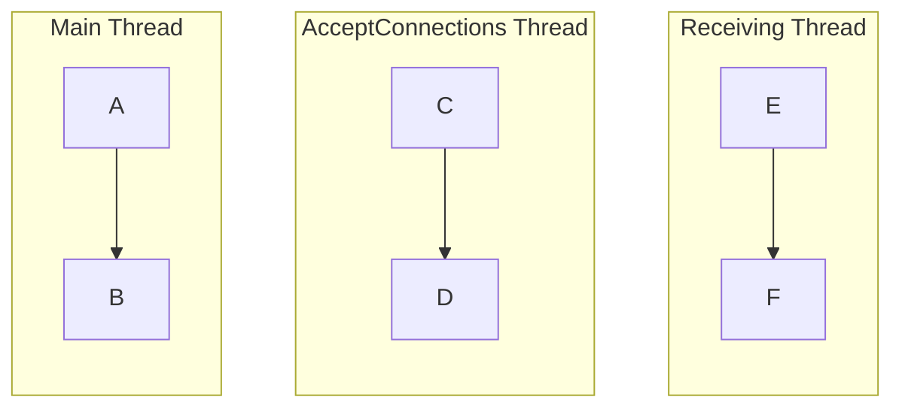

```mermaid
flowchart LR
  mt ~~~ act ~~~ rt
  subgraph mt [Main Thread]
    direction TB
    A-->B
  end
  subgraph act [AcceptConnections Thread]
    direction TB
    C-->D
  end
  subgraph rt [Receiving Thread]
    direction TB
    E-->F
  end
```
