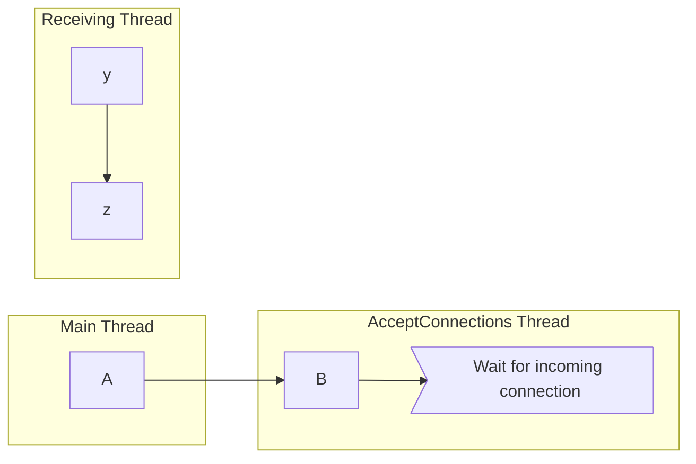

```mermaid
flowchart LR
  subgraph acthread [AcceptConnections Thread]
    direction TB
    B-->F>Wait for incoming connection]
  end
  subgraph mt [Main Thread]
    direction TB
    A-->B
  end
 subgraph rt [Receiving Thread]
  direction TB
  y-->z
 end
```
