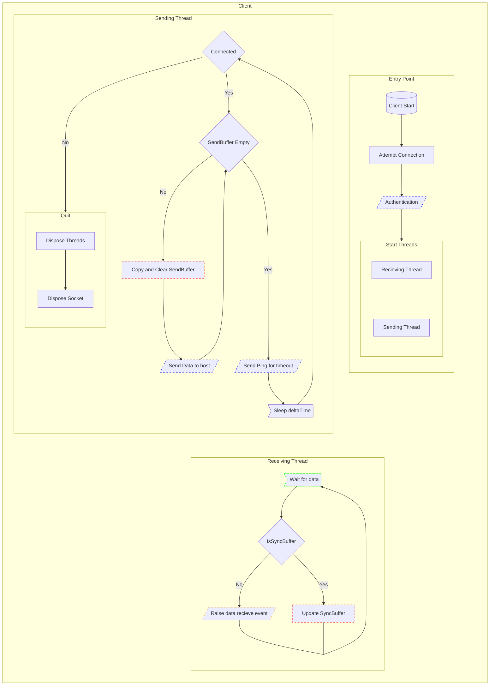

<div id="doc-title"></div>
<h1 align="center"> ThornNetworking </h1>
<p align="center"><a href="#doc-about">About</a> <a href="#doc-installation">Installation</a> <a href="#doc-documentation">Documentation</a> <a href="#doc-diagrams">Diagrams</a> </p>


<div id="doc-about"></div>
<h2>About</h2>
<p>This repository is a personal project with the goal of becoming an multithreaded and easy-to-use C# Class Library networking solution with a plug-and-play style system where users can easily host or join, with a variety of connection methods, using only a few simple function calls after being added as a project depenency.
</br>
</br>
If the project meets the usecase of whoever happens to stubmle upon it, it is free to use as is in projects or to dissect as a learning resource.
</p>


<div id="doc-installation"></div>
<h2>Installation</h2>
<a href="https://www.nuget.org/packages/ThornNetworking/"></a>

<p>To install with the Nuget Package Manager, simply run:</p>

```bash
Install-Package ThornNetworking [-Version x.x.x]
```
<p> Omit the -Version to automatically install the latest version or specify the x.x.x for a certain version.
</br>
</br>
Once the package has been installed, to start using it in your code just add:</p>

```C#
using ThornNetworking;
```


<div id="doc-documentation"></div>
<h2>Documentation</h2>
<p>The following is a simple class diagram of everything nessecary to set up hosting and connecting in a project:</p>


<p>The NetworkManager is a singleton style class initialized on project startup that acts as the interface between the internal networking system and external projects.</p>

```C#
NetworkManager manager = NetworkManager.Instance;
```

<p>The project works on an event based framework so that means you set a function to run each time data is received which will be called with the format:</p>

```C#
ReceiveFunction(data: byte[])
```

<p>The receive function can be set with the following call:</p>

```C#
NetworkManager.Instance.SetRecieveFunction(function: Action<byte[]> );
```

<p>To start a host call:</p>

```C#
NetworkManager.Instance.StartHost(ip: System.Net.IPAddress, port: Integer);
```

<p>To join as a client call:</p>

```C#
NetworkManager.Instance.StartClient(ip: System.Net.IPAddress, port: Integer);
```

<p>To send data call:</p>

```C#
NetworkManager.Instance.SendData(data: byte[], destinations: [System.Net.IPAddress]);
```

<p>To send data to every client as the host, or the host as any client, call the same function without any destinations:</p>

```C#
NetworkManager.Instance.SendData(data: byte[]);
```

<div id="doc-diagrams"></div>
<h2>Diagrams</h2>
<h3>Legend</h3>
<p>The following legend can be used for the two following flowchart diagrams which depict the code flow for hosts and clients:</p>


<h3>Host</h3>


<h3>Client</h3>


